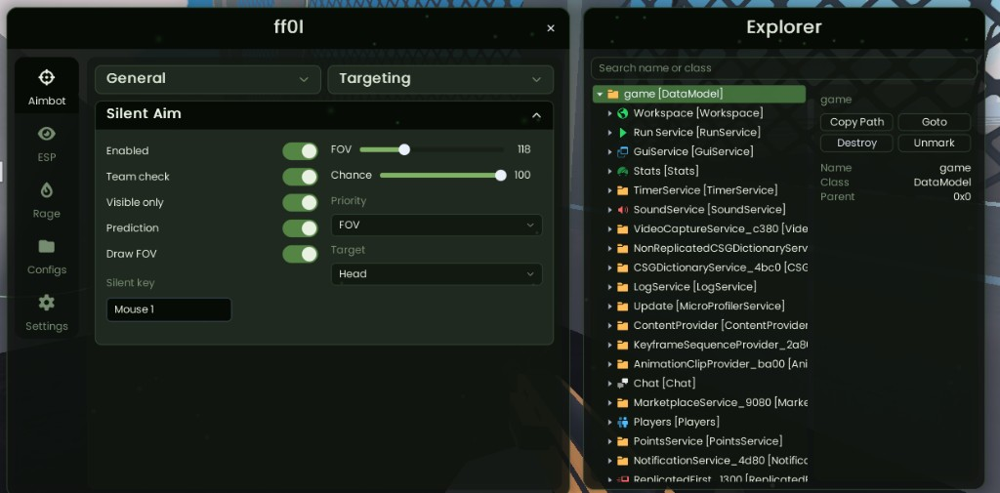

<p align="center">
  
</p>

<h1 align="center">FF0L</h1>

<p align="center">
  A fullscreen Windows overlay for Roblox.<br>
  Aimbot, silent aim, ESP, rage movement, configs, and a live DataModel explorer.
</p>

<p align="center">
  <b>Offsets update automatically</b> on launch — FF0L checks the live Roblox version and pulls a fresh table when the game patches.
</p>

<p align="center">
  <a href="https://github.com/ff0l/Roblox-external/releases/latest"><b>Download the compiled Windows release</b></a>
  ·
  <a href="https://github.com/ff0l/Roblox-external/archive/refs/heads/main.zip"><b>Source</b></a>
</p>

Download <code>ff0l.exe</code> and run it. Fonts and icons are embedded — no extra folder is required. The source tree already includes the UI framework and fonts — run <code>build.bat</code> to compile.

---

## Preview

<p align="center">
  <video src="media/menu.mp4" controls muted playsinline width="900">
    <a href="media/menu.mp4">Menu walkthrough</a>
  </video>
</p>

<p align="center">Menu, settings, theme, explorer, and the offset refresh.</p>

<p align="center">
  <video src="media/ingame.mp4" controls muted playsinline width="900">
    <a href="media/ingame.mp4">In-game overlay</a>
  </video>
</p>

<p align="center">Silent aim FOV, ESP, distance, and the FF0L watermark in a match.</p>

- [Menu walkthrough](media/menu.mp4)
- [In-game overlay](media/ingame.mp4)

---

## What it is

FF0L is a transparent, click-through overlay. The menu sits in the center of the screen. Clicks on the panel stay with FF0L. Clicks outside go through to the game.

Insert shows or hides the menu (the bind is remappable). Escape never quits FF0L — it only closes a listen, a dropdown, the explorer, or a draft.

Configs and the offset cache live in `%AppData%\ff0l`.

---

## Offsets

FF0L does not ship a frozen offset list.

On startup it:

1. Asks `offsets.imtheo.lol` for the current Roblox version
2. Downloads `offsets.json` when that version changed
3. Applies the table and writes it to `%AppData%\ff0l`
4. Falls back to the last good cache if you are offline

Settings shows the active version hash and a **Refresh** control if you want to force a pull. After a Roblox update, launch FF0L and let it sync — you do not edit offsets by hand.

---

## Features

### Aimbot

| Control | What it does |
| --- | --- |
| Enabled | Hold-to-aim with a remappable key (default right mouse) |
| Team check | Skip teammates |
| Visible only | Skip targets the local camera cannot see |
| Sticky aim | Keep the current target while the key is held |
| Prediction | Lead moving targets with ping and distance |
| FOV | Screen radius, with an optional drawn circle |
| Smooth | How fast the cursor settles |
| Priority | Closest to crosshair, closest in world, or a mix |
| Target | Head, neck, chest, stomach, body, legs |

### Silent aim

Same targeting rules, on its own key (default left mouse).

| Control | What it does |
| --- | --- |
| Chance | `0` never fires silent. `100` always does. Values in between roll once per press |
| Prediction | Optional lead, kept close to the selected bone |
| Target | The bone you pick is the bone it uses — Head stays on the head |
| Draw FOV | Circle on the overlay |

### ESP

| Overlay | Visuals | Colors |
| --- | --- | --- |
| Box | Skeleton | Per-feature visible / hidden swatches |
| Name | Snaplines | Or one tint for every feature |
| Health | Range (25–2000) | Matcha and other themes |
| Distance | Team check | |

### Rage

Jump power, infinite jump, and noclip. Nothing else lives on that tab.

### Explorer

A live DataModel tree next to the menu.

- Search by name or class
- Copy path, goto, destroy, mark / unmark
- Name, class, and parent for the selected instance

### Settings

| Group | Options |
| --- | --- |
| Misc | FPS cap, VSync, menu key |
| Game | Anti-AFK, uncapped FPS, explorer, offset version + refresh |
| Theme | Colors, shader, particles |
| Overlay | Watermark, FPS, streamproof, menu opacity, ESP range |

Configs save and load from the Configs tab. Each file is a plain text preset under `%AppData%\ff0l\configs`.

---

## Controls

| Key | Action |
| --- | --- |
| Insert | Show or hide the menu (default, remappable) |
| Escape | Close listen / dropdown / explorer / draft only |
| Silent key | Hold to apply silent aim (default Mouse 1) |
| Aim key | Hold to apply aimbot (default Mouse 2) |

---

## Use

1. Grab the [compiled release](https://github.com/ff0l/Roblox-external/releases/latest)
2. Unzip
3. Run `ff0l.exe`

`assets/` must stay beside the exe. Offsets still sync on first launch.

## Build

The source zip has everything needed to compile. Double-click `build.bat`.

Windows 10 or 11, x64. Visual Studio 2022 or newer with **Desktop development with C++** (CMake is in that workload). No other repos, no extra packages.

```
build.bat
build.bat --debug
```

Output: `build\windows-release\ff0l.exe` (or `build\windows-debug\ff0l.exe`). The UI framework lives in `third_party/custom-framework`. Fonts live in `third_party/fonts`.

---

## Layout

```
build.bat           one-click compile
assets/             themes and extras (fonts/icons are compiled into the exe)
src/                overlay, aim, ESP, configs
third_party/custom-framework   bundled UI library
third_party/fonts              Poppins + Font Awesome
media/              README preview, menu clip, in-game clip
```

---

## Requirements

- Windows 10 or 11, 64-bit
- Roblox (`RobloxPlayerBeta.exe`)
- Network on first launch so offsets can sync (after that, the cache is enough)
- Visual Studio only if you run `build.bat` — not required to run the release exe

**FF0L**.
