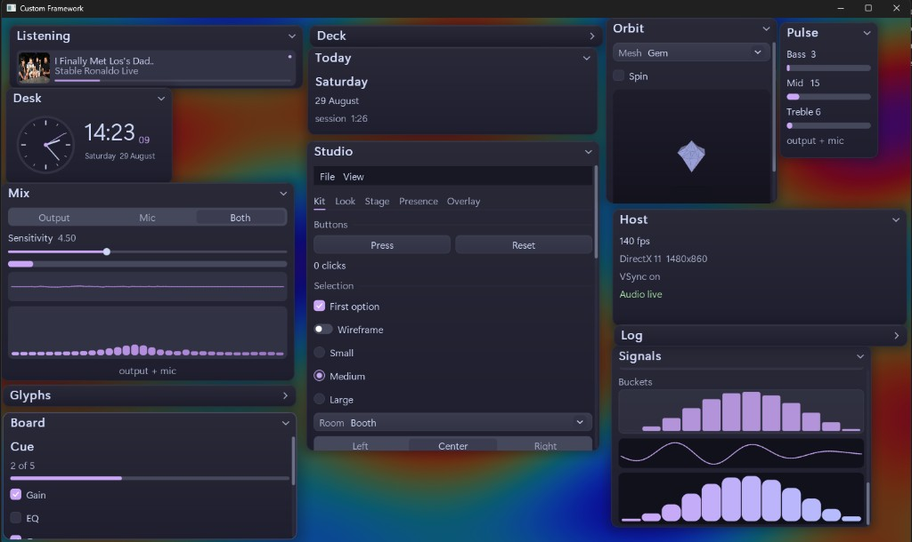

# Custom Framework

A custom immediate-mode C++ UI framework for Windows. You include one header, call `run`, and draw widgets every frame.



## Graphics

Pick a backend at startup or switch at runtime. Auto tries them in this order:

| Backend | API | Notes |
| --- | --- | --- |
| Direct3D 11 | D3D11 + DXGI | Default path. Works on Windows 10 and 11. |
| Direct3D 12 | D3D12 + DXGI | Same UI, newer device stack. |
| OpenGL | WGL / desktop OpenGL | Fallback when you want GL. |
| Vulkan | Optional | Off unless you build with `-DUR_VULKAN=ON` and have the Vulkan SDK. |

The window, DPI, swapchain, and input are Win32. The same widget tree runs on every backend. Glyphs, player art, and fullscreen effects rebind when you change host.

## What you get

- Immediate-mode widgets: buttons, sliders, fields, tables, tabs, menus, plots
- Floating frames that drag, resize, collapse, and hug their content
- Docking, command palette, toasts, themes
- Optional desk modules: now playing, system / mic audio, analog clock, 3D orbit, Discord presence, click-through overlay

`Widgets`, `Frames`, and `Layout` are the full API. `ur::ui` is the short path. Widget IDs use `##` — `"OK##save"` stays unique, `"Desk###face"` shows only Desk.

## Build

Windows 10 SDK, MSVC, CMake 3.20, Ninja.

```
cmake --preset windows-release
cmake --build --preset windows-release
```

| Output | What it is |
| --- | --- |
| `build/windows-release/Hello.exe` | Twenty-line start |
| `build/windows-release/Showcase.exe` | Full desk |

Keep `assets/` next to the exe, or run from this directory.

```cmake
-DUR_VULKAN=ON
```

turns on the Vulkan backend.

## Hello

```cpp
#include "ur/ur.hpp"

int WINAPI WinMain( HINSTANCE, HINSTANCE, LPSTR, int ) {
    ur::app::Config Config;
    Config.title = "My tool";
    Config.backend = ur::Backend::DX11;
    return ur::app::run( Config, [ ] {
        if ( ur::ui::window Window( "Hello" ); Window ) {
            ur::ui::label( "Direct3D 11, Direct3D 12, or OpenGL." );
            if ( ur::ui::button( "Quit" ) )
                ur::app::quit( );
        }
    } );
}
```

`ur::Backend::DX11`, `DX12`, `OpenGL`, `Vulkan`, or `Auto`.

## Tree

```
include/ur          public headers
src/app             window, settings, theme
src/engine          widgets, layout, backends
src/host            D3D11, D3D12, OpenGL, Vulkan hosts
src/ui              toast, palette, motion
src/widgets         player, orbit, desk
src/audio           hear
demos/hello         short start
demos/showcase      full desk
```

[Start](docs/start.md) covers widgets, IDs, themes, and the desk modules. [Build](docs/build.md) is the compile notes.

## Optional

Copy `.env.example` next to the exe:

```
UR_DISCORD_APP_ID=
UR_SPOTIFY_CLIENT_ID=
```

Now playing uses the Windows media session. Discord stays off until you set an app id. Hear can follow PC output, the microphone, or both.
